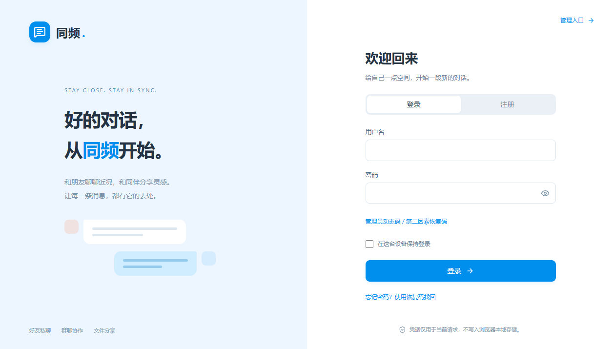
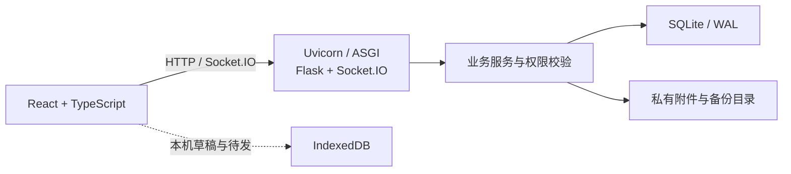

<div align="center">

# 同频 · TongPin ChatRoom

**好的对话，从同频开始。**

一个可自行托管的聊天与待办应用，让好友交流、群组协作和任务管理在同一处发生。


[](LICENSE)

[项目介绍](#项目介绍) · [功能一览](#功能一览) · [技术简介](#技术简介) · [前端演示](#前端演示) · [安装使用](#安装使用) · [开发指南](#开发指南) · [文档导航](#文档导航)

</div>

---



<p align="center"><sub>当前界面的实际截图 · 浅灰浅蓝视觉风格 · 中文交互</sub></p>

## 项目介绍

**同频（TongPin）** 将即时通讯与待办协作放在同一个应用中：你可以与好友私聊，在群组中分享图片和文件，把讨论转成任务，再通过列表、看板和提醒跟进进度。

项目采用 **Python 后端 + React 前端 + SQLite 持久化**，账号、聊天记录、任务和管理操作均接入实际后端服务。前端构建后由后端统一提供，适合希望自行掌握部署位置和数据存储的个人、小组与自托管使用者，也可用于学习实时通信、权限管理和前后端协作。

- **聊天与待办相连**：消息可转为待办，个人任务与群任务分别管理。
- **数据由自己托管**：账号、消息、附件和任务保存在部署主机的指定目录。
- **断网时保留输入**：通过浏览器本机草稿与待发队列保留未完成内容，联网后按当前身份和权限处理。
- **提供站点管理能力**：超级管理员可管理账号、群组、内容、运营策略、审计与备份。

当前版本为 **0.1.0**。阶段交付与验证范围见 [实施状态](implementation/STATUS.md)；历史测试记录与当前安装包的验证范围应分别阅读。

## 功能一览

| 模块 | 主要能力 |
| :--- | :--- |
| 💬 即时聊天 | 好友申请与屏蔽、私聊、群聊、群角色与邀请审核、历史同步、发送与已读状态 |
| ✨ 消息互动 | 表情、回复、提及、反应、撤回、收藏、搜索定位、举报与通知 |
| 📎 图片与文件 | 文件选择、粘贴与拖拽上传、图片预览、受权限控制的下载、上传状态与配额提示 |
| ✅ 待办协作 | 个人与群任务、负责人、优先级、检查项、截止日期与时区、列表与看板、评论与提醒 |
| 🔄 聊天转任务 | 从消息创建待办、查看来源、分享实时任务卡片或静态副本、复核离线任务草稿 |
| 👤 账号与设置 | 个人资料、头像、设备会话、隐私与通知设置、恢复码、注销冷静期 |
| 🛠️ 管理后台 | 账号与群组治理、内容与文件审阅、监控告警、配置版本、公告举报、审计、受控导出与备份 |

更完整的操作说明见 [用户指南](docs/USER_GUIDE.zh-CN.md) 和 [超级管理员指南](docs/ADMIN_GUIDE.zh-CN.md)。

## 技术简介

| 层次 | 技术 | 在项目中的作用 |
| :--- | :--- | :--- |
| 前端界面 | React 19、TypeScript、Vite 8、Lucide | 页面与组件、类型检查、前端构建、界面图标 |
| HTTP 服务 | Python 3.12.13、Flask | 账号、聊天、任务与管理接口 |
| 实时通信 | python-socketio、Socket.IO Client | 消息与状态事件、实时同步 |
| 服务运行 | ASGI、Uvicorn | 承载 HTTP 与 Socket.IO 服务 |
| 服务端存储 | SQLite、WAL、SQL 迁移 | 账号、消息、任务、策略与审计数据持久化 |
| 浏览器存储 | IndexedDB | 按账号隔离的本机草稿与离线待发 |
| 身份与安全 | Argon2、TOTP、会话与权限校验 | 密码保护、管理员第二因素、敏感操作验证 |
| 工程工具 | uv、npm、Ruff、pytest、Vitest、Playwright | 依赖锁定、代码检查、自动化测试与浏览器验证 |



构建后的页面与接口使用同一个服务地址。当前运行方式为 **单个 ASGI 进程、单个 SQLite 数据目录**，数据目录设有独占锁；不要让多个 worker 或多个应用副本共用同一份数据库。

## 前端演示

希望先体验界面和交互，可以打开独立的 **[demo/index.html](demo/index.html)**。它复制当前产品前端的页面与样式，内置虚构人物、会话、附件、待办和管理数据，所有操作在当前浏览器中完成，**不与业务后台通信**。新发行包同时包含整个 `demo/` 目录和已构建的单文件页面。

- **直接打开**：把发行包解压后，用浏览器打开 `demo/index.html`，无需安装 Python、Node.js 或后端依赖。
- **Windows 静态预览**：双击 `demo/start-demo.cmd`，已有 Python 时自动打开 `http://127.0.0.1:5178/`；没有 Python 时直接打开 HTML。此入口不安装环境。
- **切换体验**：顶部“演示控制”可进入未登录状态、切换普通账号 / 群角色 / 超级管理员、模拟离线、开关自动回复及恢复初始数据。
- **演示凭据**：默认账号 `linyuan`，管理员 `demo_admin`；初始密码均为 `DemoPassword2026!`，图形验证码 `1234`，动态码 `123456`。

支持聊天、好友、群管理、文件、任务、账号设置和全部管理导航的本地交互。修改可刷新保留；监控、扫描、通知授权与服务器备份为模拟，导出的演示归档不能恢复正式应用。详细步骤、存储范围和构建方式见 **[演示说明](demo/README.md)**。

## 安装使用

### 选择安装方式

| 方式 | 适合谁 | 需要手动准备 |
| :--- | :--- | :--- |
| **已构建前端的发布 ZIP** | 希望直接运行应用 | 联网及系统包管理器所需权限；**Python 可以自动安装** |
| **从源码安装** | 需要修改或重新构建前端 | Node.js 24.x、npm 11.x；Python 可以自动安装 |

两种方式的项目运行时均锁定为 **Python 3.12.13**，后端依赖由 `uv.lock` 固定。安装入口会检测系统、架构和 Linux 发行版：已有 Python 3.8+ 时复用它完成引导；没有时通过系统包管理器安装，再准备项目指定的 Python、uv 和后端依赖。首次安装需要联网，系统安装阶段可能要求 sudo、doas 或 Windows 授权。

### 方式一：使用发布包

将已经包含前端的 ZIP 解压到一个有写入权限的独立目录。**无需预先手动安装 Python、Node.js、npm 或 uv。** Windows 需要可用的 winget；Linux 使用发行版包管理器；macOS 缺少包管理器时会自动准备 Homebrew。若拿到的是仓库源码，请使用下一节的源码安装方式。

**Windows**

双击解压目录中的 `install.cmd`，等待安装完成。随后在该目录打开 PowerShell：

```powershell
# 首次部署：创建超级管理员
.\tongpin.cmd manage init-admin

# 启动应用
.\tongpin.cmd run
```

**Linux / macOS**

在解压目录打开终端，执行：

```sh
# 安装运行环境与后端依赖
sh ./install.sh

# 首次部署：创建超级管理员
sh ./tongpin.sh manage init-admin

# 启动应用
sh ./tongpin.sh run
```

使用 `sh` 调用不依赖 ZIP 是否保留脚本的可执行权限。可先运行 `install.cmd --dry-run` 或 `sh ./install.sh --dry-run` 查看检测结果和安装计划，这不会下载或安装软件。发行版支持范围、提权和故障处理见 [自动安装说明](INSTALL-PYTHON.zh-CN.md)。

> **平台验证说明：** 同一份发布包提供 Windows、Linux 和 macOS 入口。系统包管理器分支使用隔离替身测试，避免修改测试主机；这不等同于真实系统安装验收。Linux/macOS 的原生包管理器安装尚未在本轮实测，仓库历史三平台 CI 的范围见阶段交付记录。

### 方式二：从源码安装

准备以下工具，并确认能在终端中调用：

- **可用的系统包管理器与安装权限**：缺少 Python 时自动准备，项目实际使用 3.12.13。
- **Node.js 24.x**：最低版本为 24.15.0。
- **npm 11.x**：最低版本为 11.12.1。

获取源码：

```sh
git clone https://github.com/JiangZhigu/TongPin-ChatRoom.git
cd TongPin-ChatRoom
```

**Windows PowerShell**

```powershell
.\install.cmd --dev --build
.\tongpin.cmd manage init-admin
.\tongpin.cmd run
```

**Linux / macOS**

```sh
sh ./install.sh --dev --build
sh ./tongpin.sh manage init-admin
sh ./tongpin.sh run
```

`--dev` 安装开发检查所需的依赖，`--build` 安装锁定的前端依赖并构建页面。系统包管理器安装的引导 Python 使用其正常安装位置；项目运行时、uv、缓存及虚拟环境使用项目目录。已有符合要求的工具或 Python 可以复用，项目依赖不会安装到系统 Python 中。

### 第一次使用

1. **初始化管理员。** 在服务未运行时执行 `manage init-admin`，按提示设置用户名、显示名、密码和验证器动态码，保存只显示一次的恢复码。项目没有默认管理员账号或密码，已有管理员时无需重复初始化。
2. **打开应用。** 启动后访问 [http://127.0.0.1:8765](http://127.0.0.1:8765)，管理后台入口为 [http://127.0.0.1:8765/admin](http://127.0.0.1:8765/admin)。
3. **创建普通账号。** 新站默认允许自主注册，可从登录页切换到“注册”。管理员可以调整为开放、仅邀请码或关闭注册；已有站点保留原有策略。
4. **开始聊天与协作。** 添加好友并建立会话，或创建群组；在待办中管理任务，也可以从消息创建待办。Enter 发送消息，Shift+Enter 换行。
5. **停止或再次启动。** 停止时按 Ctrl+C 并等待退出。以后直接执行 `tongpin.cmd run` 或 `sh ./tongpin.sh run`，无需重复安装。

如果 Windows 执行策略阻止 PowerShell 入口，可改用直接 Python 命令，示例见 [安装说明](INSTALL-PYTHON.zh-CN.md#windows)。

## 配置与数据

本机试用可以直接使用默认配置。需要调整时，参考 [.env.example](.env.example) 创建根目录的 `.env`，或通过环境变量、`--env-file` 提供配置；**已有环境变量优先于配置文件**。

| 常用配置 | 默认值 / 用途 |
| :--- | :--- |
| `TONGPIN_ENV` | `development`；可选 `test`、`production` |
| `TONGPIN_HOST` | `127.0.0.1`；开发与测试模式仅绑定本机 |
| `TONGPIN_PORT` | `8765` |
| `TONGPIN_DATA_DIR` | `var`；数据库、附件等持久数据的根目录 |
| `TONGPIN_ORIGINS` | 允许访问的准确来源；生产环境要求 HTTPS |
| `TONGPIN_SECRET` | 生产环境由运营者提供的外部密钥 |

默认数据库为 `var/data/tongpin.sqlite3`。附件、备份、导出和日志位于数据目录的非公开子目录；发布 ZIP 不包含用户数据。浏览器本机草稿保存在当前浏览器中，清理浏览器数据或更换设备会影响这些草稿。

升级前备份持久数据，保留原有密钥，将新版本放入独立目录并按升级流程切换。配置项及重启要求见 [配置参考](docs/CONFIGURATION.zh-CN.md)，备份、恢复、升级与回滚见 [运维指南](docs/OPERATIONS.zh-CN.md)。

### 部署与隐私边界

- **服务端可管理的数据。** 站点超级管理员可以通过受审计流程审阅私聊、群聊和附件，本项目不提供端到端加密。个人待办有独立访问权限，不因超级管理员身份而在普通查询中任意开放。
- **离线不等于已发送。** 本机待发和任务草稿需要在联网后重新核对身份、权限与服务端状态；离线任务草稿需要本人确认后提交。
- **文件扫描需配置。** 项目提供本地 ClamAV 扫描器适配；扫描服务未配置或不可用时，一般文件按策略隔离，不代表安装后已自动启用病毒扫描。
- **公网部署需完成生产配置。** 配置 HTTPS、准确来源、外部密钥、专用持久目录和运营资料，并执行生产预检。本机启动成功不代表公网部署完成。

## 开发指南

完成源码安装后，在项目根目录使用以下命令：

| 命令 | 作用 |
| :--- | :--- |
| `npm run dev` | 同时启动前端开发服务和后端 |
| `npm run build` | 构建前端并生成构建凭据 |
| `npm run start` | 启动已安装环境中的应用 |
| `npm run check` | 执行 Ruff、后端测试、TypeScript 检查和前端测试 |

开发模式的前端地址是 `http://localhost:5173`，后端地址是 `http://127.0.0.1:8765`；构建后的页面由后端同源提供。启动开发模式前，先停止使用同一数据目录的现有实例。

项目主要目录：

```text
TongPin-ChatRoom/
├── apps/web/          # React 前端、页面组件与前端测试
├── src/tongpin/       # Python 后端、业务服务、接口与数据库迁移
├── scripts/           # 安装、启动、构建、检查及发布工具
├── tests/             # 后端与部署相关测试
├── docs/              # 安装、配置、使用与运维文档
├── implementation/    # 接口约定、阶段交付与验证记录
├── var/               # 默认运行数据，首次运行时生成
├── uv.lock            # Python 依赖锁定文件
└── package-lock.json  # 前端依赖锁定文件
```

## 文档导航

| 你想了解 | 阅读文档 |
| :--- | :--- |
| 没有 Python，自动准备环境并使用发布包 | [发布包安装说明](INSTALL-PYTHON.zh-CN.md) |
| 安装入口、平台差异与命令参数 | [安装与平台入口](docs/INSTALL.zh-CN.md) |
| 环境变量、站点策略与生产预检 | [配置参考](docs/CONFIGURATION.zh-CN.md) |
| 聊天、群组、文件、待办与账号操作 | [用户指南](docs/USER_GUIDE.zh-CN.md) |
| 管理账号、审计、内容治理与后台操作 | [超级管理员指南](docs/ADMIN_GUIDE.zh-CN.md) |
| 部署、备份、监控、升级与回滚 | [运维指南](docs/OPERATIONS.zh-CN.md) |
| 当前 HTTP / Socket.IO 接口 | [接口约定](implementation/API_CURRENT.zh-CN.md) |
| 已实现范围、阶段验证与交付状态 | [实施状态](implementation/STATUS.md) |

## 许可证

本项目使用 [Apache License 2.0](LICENSE)。第三方组件及相关说明见 [THIRD_PARTY_NOTICES.md](THIRD_PARTY_NOTICES.md)。
